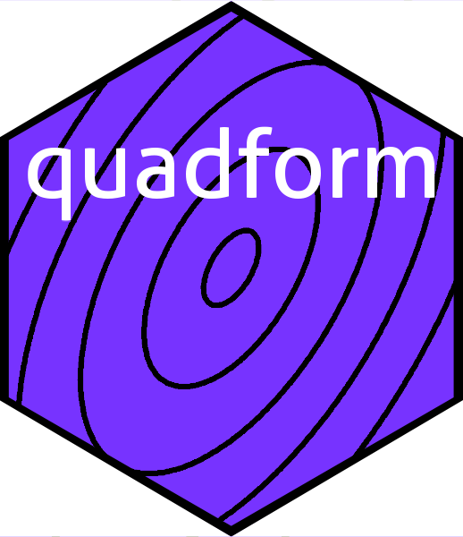

Quadratic forms in R: the `quadform` package
================

<!-- README.md is generated from README.Rmd. Please edit that file -->

# 

<!-- badges: start -->

<!-- badges: end -->

# Overview

Quadratic forms are polynomials with all terms of degree 2. Given a
vector ${\mathbf x}=(x_1,\ldots,x_n)$ and an $n\times n$ matrix $M$ the
expression

$$x^TMx$$

is a quadratic expression; if $x$ is complex \[we usually denote complex
vectors with $z$\] then we have

$$z^*Mz$$

where $z^*$ means the complex conjugate of $z^T$. These are implemented
in the package with `quad.form(M,x)` which is essentially

`quad.form <- function(M,x){crossprod(crossprod(M, Conj(x)), x)}`

This is preferable to `t(x) %*% M %*% x` on several grounds. Firstly, it
streamlines and simplifies code; secondly, it is more efficient; and
thirdly it handles the complex case consistently. The package includes
similar functionality for other related expressions.

The package is maintained on
[github](https://github.com/RobinHankin/quadform).
